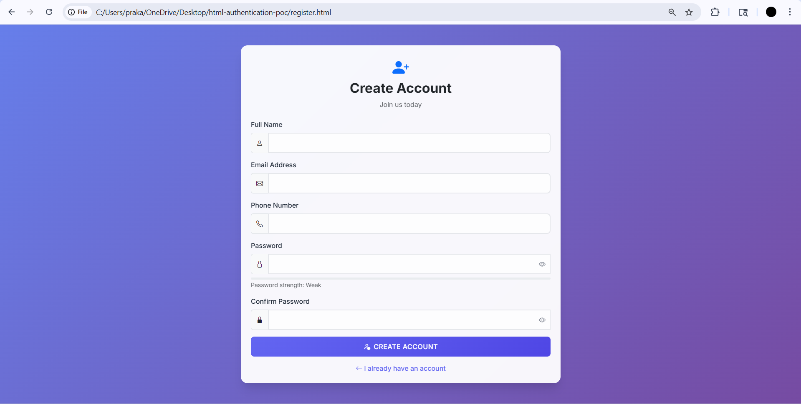
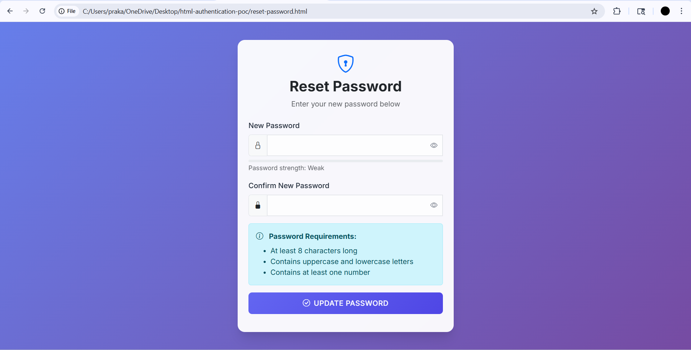
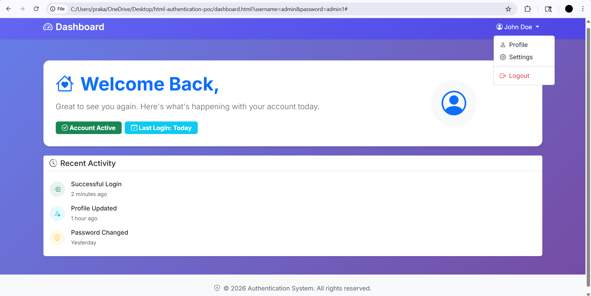

# Authentication System - Styled with Bootstrap 5

A professional, responsive authentication system built with HTML5, Bootstrap 5, and custom CSS. This project includes login, registration, password recovery, and dashboard functionality with modern UI/UX design.

## 🚀 Features

- **Responsive Design**: Works seamlessly on desktop, tablet, and mobile devices
- **Bootstrap 5 Integration**: Modern UI components and grid system
- **Custom Styling**: Professional color scheme with smooth animations
- **Interactive Elements**: Password visibility toggles, form validation, loading states
- **Accessibility**: Proper ARIA labels and semantic HTML structure
- **Password Strength Indicator**: Real-time password strength validation
- **Form Validation**: Client-side validation with visual feedback

## 📱 Pages Included

1. **Login Page** (`index.html`)
   - Username/password authentication
   - Password visibility toggle
   - Links to registration and password recovery

2. **Registration Page** (`register.html`)
   - Complete user registration form
   - Password strength indicator
   - Real-time password confirmation validation
   - Responsive form layout

3. **Forgot Password Page** (`forgot-password.html`)
   - Email-based password recovery
   - Success feedback messages
   - Clean, focused interface

4. **Reset Password Page** (`reset-password.html`)
   - Secure password reset functionality
   - Password strength validation
   - Confirmation matching

5. **Dashboard Page** (`dashboard.html`)
   - Professional dashboard layout
   

## 🎨 Design Features

- **Modern Color Scheme**: Professional purple gradient theme
- **Google Fonts**: Inter font family for clean typography
- **Smooth Animations**: Hover effects and transitions
- **Glass Morphism**: Semi-transparent cards with backdrop blur
- **Bootstrap Icons**: Consistent iconography throughout
- **Custom CSS Variables**: Easy theme customization

## 📱 Responsive Breakpoints

- **Desktop**: 1920px and above
- **Laptop**: 1366px - 1920px
- **Tablet**: 768px - 1024px
- **Mobile**: 320px - 767px

## 🛠️ Technologies Used

- HTML5
- CSS3 (Custom Variables, Flexbox, Grid)
- Bootstrap 5.3.0
- Bootstrap Icons 1.10.0
- JavaScript (ES6+)
- Google Fonts (Inter)

## 💡 Key Features Implemented

### Bootstrap Integration
- Bootstrap 5 CDN links in all pages
- Bootstrap Icons for consistent iconography
- Bootstrap JavaScript bundle for interactive components
- Responsive grid system implementation

### Custom Styling
- Professional color scheme with CSS variables
- Google Fonts integration (Inter)
- Smooth hover effects and transitions
- Custom card styling with glass morphism
- Gradient backgrounds and shadows

### Interactive Features
- Password visibility toggles
- Password strength indicators
- Form validation with visual feedback
- Loading animations on form submission
- Responsive navigation menu

### Responsive Design
- Mobile-first approach
- Flexible layouts for all screen sizes
- Touch-friendly interface elements
- Optimized typography scaling

## 📸 Screenshots

### Login Page

### Registration Page

### Forgot Password Page

### Reset Password Page

### Dashboard Page

## 🔧 Customization

The project uses CSS custom properties (variables) for easy theme customization:

## 📝 Assignment Completion

This project fulfills all requirements for **Assignment 3: Authentication System Styling**:

-  Bootstrap 5 integration across all pages
-  Professional styling using Bootstrap components
-  Custom CSS with modern design elements
-  Fully responsive design for all device sizes
-  Clean, well-organized code structure
-  Comprehensive documentation with screenshots

## 👨‍💻 Developer

**Student**: Fakeerappa Nilappa Solabannavar  
**Course**: Fullstack Java Development  
**Institution**: CampusPe  
**Mentor**: Jacob Dennis  
**Year**: 2026

*Built using Bootstrap 5 and modern web technologies*